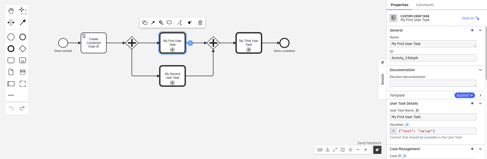
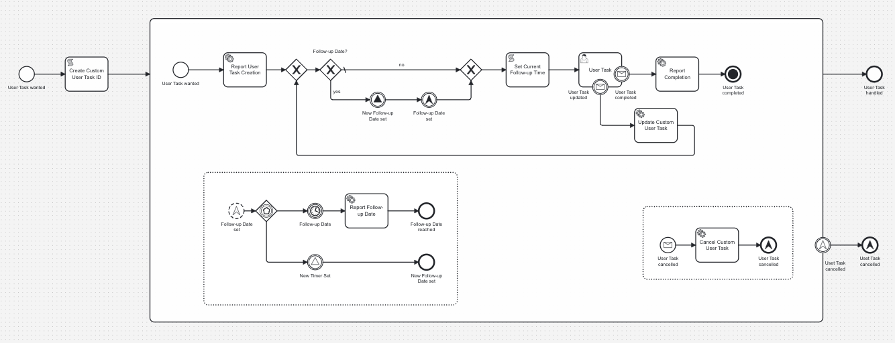
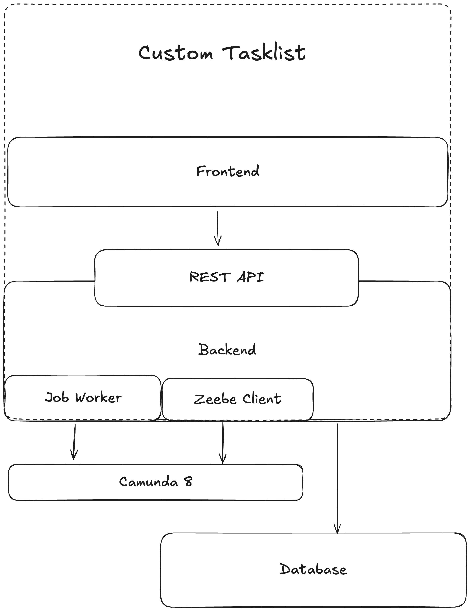
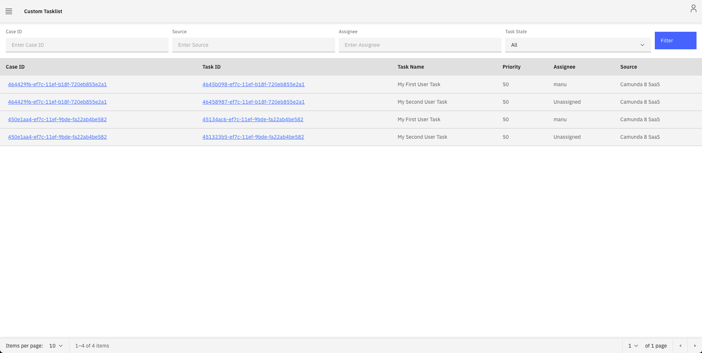
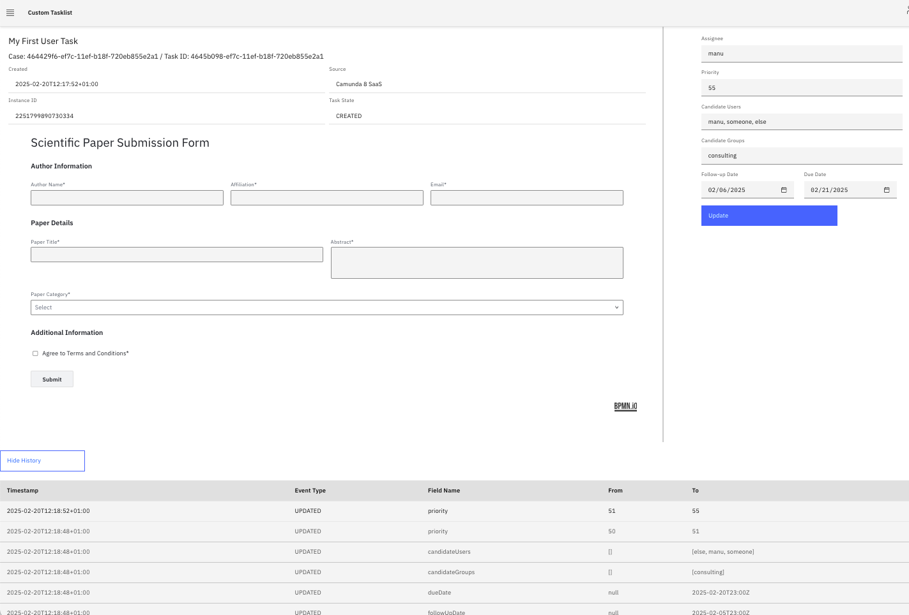

# Push-Based Tasklist

> ### ⚠️ Disclaimer
> 
> This project is created **solely for demonstration purposes** to illustrate a conceptual solution.  
> It is **not intended for production use** and may lack security hardening, performance optimizations,  
> or best practices required for a real-world deployment.
> ---
> **💡 Note:** If the frontend looks questionable, that's because it was built by a **backend engineer**.  
> Expect functionality over aesthetics, and don’t be surprised if the CSS has an existential crisis.


## Overview
The **Push-Based Tasklist** is a web application that provides a task management interface. It integrates with Camunda 8 SaaS and leverages the Job Worker Concept to retrieve information about a task.


## How does it work?
Instead of using the default user task, we leverage our custom call activity template [Custom User Task.json](src/main/resources/camunda/Custom%20User%20Task.json), that allows us to model and manage the lifecycle of a User Task.



The modeled Process allows job workers to work on events (task created, updated etc.). This can be extended based on your requirements.



Events will be stored in the Database that will also allow you to track updates to a usertask, independent of Camunda.




## Configuration
The application is configured via `application.yaml`. Key configuration options include:

- **Camunda Integration**: Define the connection details for the task source.
- **Authentication**: Configure OAuth2 settings if required.
- **Application Settings**: Set parameters for UI behavior and backend processes.

Update `application.yaml` as needed before starting the application.

## Getting Started

### Prerequisites
- Java 17 or higher
- Maven

### Build and Run
1. Clone the repository:
   ```sh
   git clone https://github.com/ManuelDittmar/push-based-tasklist.git
   cd push-based-tasklist
   ```
2. Build the application:
   ```sh
   mvn clean package
   ```
3. Start the application:
   ```sh
   java -jar target/push-based-tasklist-*.jar
   ```

## Accessing the Application
- **Tasklist UI**: [http://localhost:8080/app/tasks](http://localhost:8080/app/tasks)
- **Swagger API Documentation**: [http://localhost:8080/swagger-ui.html](http://localhost:8080/swagger-ui.html)

## Limitations / TODOs
- **Sync via Tasklist API**: Ideally the Application checks periodically via the API if maybe a User Task was canceled externally, e.g. via cancelling a process instance.
- **Hardcoded Form**: Form is currently hardcoded and the same for all user tasks.



